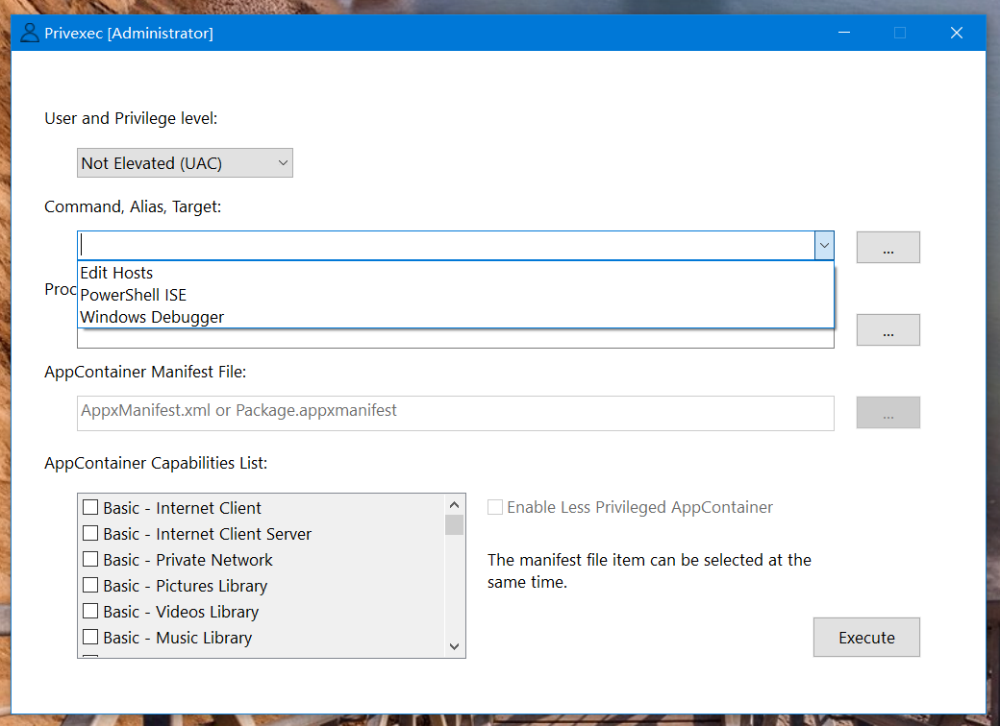
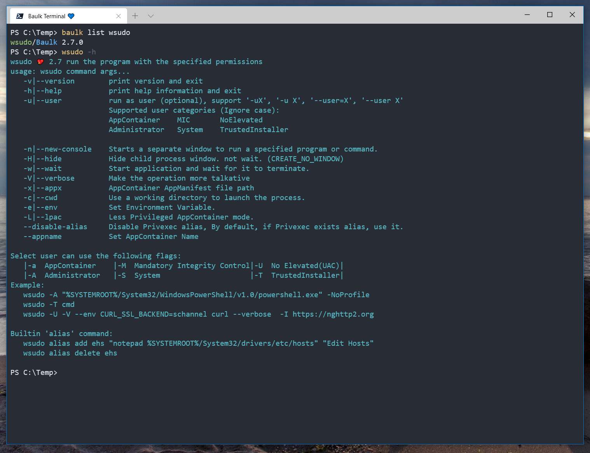
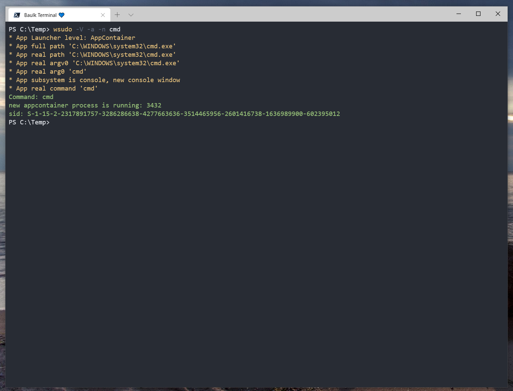
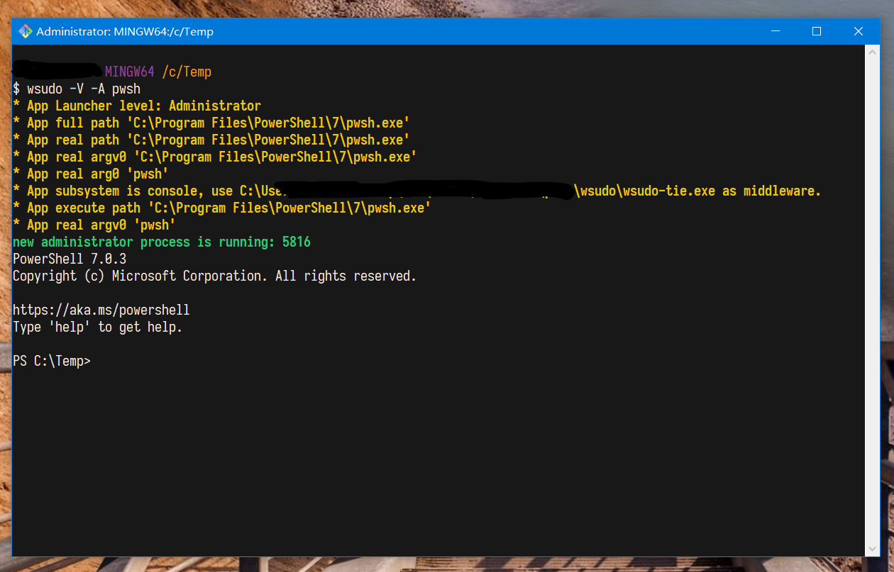

# Privexec

[](LICENSE)
[](https://github.com/M2Team/Privexec/actions)
[](https://github.com/M2Team/Privexec/releases/latest)
[](https://github.com/M2Team/Privexec/releases)
[](https://996.icu)

使用特定的用户权限运行程序

## 安装

使用 [baulk](https://github.com/baulk/baulk) 安装 Privexec

```powershell
baulk install wsudo
wsudo --version
```

当然你可以直接下载压缩包，然后使用 7z/WinRar/资源管理器等提取到任意目录运行 Privexec/AppExec/wsudo，下载链接: [https://github.com/M2Team/Privexec/releases/latest](https://github.com/M2Team/Privexec/releases/latest)


## 别名

Privexec 和 wsudo 能够解析别名，另外 wsudo 添加或者删除别名，使用 vscode 编辑 `Privexec.json` 修改别名也是不错的选择，当 Privexec 通过 baulk 安装时，`Privexec.json` 的存储目录为 `$BAULK_ROOT/bin/etc`，如果 Privexec 直接下载解压，那么 `Privexec.json` 则在 `Privexec.exe` 相同的目录。 

```json
{
    "alias": [
        {
            "description": "Edit Hosts",
            "name": "edit-hosts",
            "target": "Notepad %windir%\\System32\\Drivers\\etc\\hosts"
        },
        {
            "description": "Windows Debugger",
            "name": "windbg",
            "target": "\"%ProgramFiles(x86)%\\Windows Kits\\10\\Debuggers\\x64\\windbg.exe\""
        }
    ]
}
```


## 截图


别名:



AppContainer:


wsudo 帮助信息输出:



wsudo Verbose 模式:



AppExec AppContainer 启动器：


## 使用帮助

Privexec 是一个 GUI 客户端, 当以标准用户运行时你可以启动管理员进程；当以管理员运行时则可以提权到 `System` 或者 `TrustedInstaller`，需要注意 `System` 或者 `TrustedInstaller` 拥有太多特权，容易破坏系统运行，使用的时候需要慎重。

AppExec 是一个启动 AppContainer 进程的程序，有一些开发者使用该程序去研究 Windows AppContainer 的运行细节，研究 AppContaner 的漏洞，UWP 应用便是运行在 AppContainer 容器中的。

wsudo 是 Privexec/AppExec 的控制台版本，详细使用帮助如下：

```txt
wsudo 😋 ♥ run the program with the specified permissions
usage: wsudo command args...
   -v|--version        print version and exit
   -h|--help           print help information and exit
   -u|--user           run as user (optional), support '-uX', '-u X', '--user=X', '--user X'
                       Supported user categories (Ignore case):
                       AppContainer    MIC       NoElevated
                       Administrator   System    TrustedInstaller

   -n|--new-console    Starts a separate window to run a specified program or command.
   -H|--hide           Hide child process window. not wait. (CREATE_NO_WINDOW)
   -w|--wait           Start application and wait for it to terminate.
   -V|--verbose        Make the operation more talkative
   -x|--appx           AppContainer AppManifest file path
   -c|--cwd            Use a working directory to launch the process.
   -e|--env            Set Environment Variable.
   -L|--lpac           Less Privileged AppContainer mode.
   --disable-alias     Disable Privexec alias, By default, if Privexec exists alias, use it.
   --appname           Set AppContainer Name

Select user can use the following flags:
   |-a  AppContainer    |-M  Mandatory Integrity Control|-U  No Elevated(UAC)|
   |-A  Administrator   |-S  System                     |-T  TrustedInstaller|
Example:
   wsudo -A "%SYSTEMROOT%/System32/WindowsPowerShell/v1.0/powershell.exe" -NoProfile
   wsudo -T cmd
   wsudo -U -V --env CURL_SSL_BACKEND=schannel curl --verbose  -I https://nghttp2.org

Builtin 'alias' command:
   wsudo alias add ehs "notepad %SYSTEMROOT%/System32/drivers/etc/hosts" "Edit Hosts"
   wsudo alias delete ehs

```

Privexec, AppExec, wsudo 启动命令时，命令行和和启动目录支持通过 `ExpandEnvironmentString` 推导.

## WSUDO 控制台行为细节

wsudo 支持的参数 `--hide` `--wait` `--new-console` 行为细节如下:

|PE 子系统|无参数|`--new-console`|`--hide`|
|---|---|---|---
|Windows CUI|等待退出/继承控制台|不等待退出/打开新的控制台|不等待退出/无控制台|
|Windows GUI|不等待退出/打开图形化窗口|不等待退出/打开图形化窗口|不等待退出/忽略|
|Windows CUI `-wait`|等待退出/继承控制台|等待退出/打开新的控制台|等待退出/无控制台|
|Windows GUI `-wait`|等待退出/打开图形化窗口|等待退出/打开图形化窗口|等待退出/忽略|

wsudo 在以标准用户启动管理员进程时，如果当前运行在控制台时，支持继承控制台窗口，如果不是运行在控制台，则无能为力，较新的 Cygwin 目前已经支持在较新的 Windows 10 上以 ConPty 启动控制台，因此时可以继承控制台窗口的，也就是终端。 下图就是佐证。


在开启了 ConPty 的 Mintty 中运行 wsudo 提升进程截图（借助 wsudo-bridge 子进程继承了 wsudo 的控制台）:



### WSUDO 环境变量

wsudo 支持通过参数 `-e/--env` 设置环境变量，例如:

```batch
::curl must enabled multiple SSL backends.
wsudo  -U -V --env CURL_SSL_BACKEND=schannel curl --verbose  -I https://nghttp2.org
```

环境变量会按照 Batch 的机制推导，即使用配对的 `%` 标记环境变量。

```powershell
# powershell
.\bin\wsudo.exe -n -e 'PATH=%PATH%;%TEMP%' -U cmd
```

```batch
::cmd
wsudo -e "PATH=%PATH%;%TEMP%" -n -U cmd
```

## Changelog

可以查看: [changelog.md](./docs/changelog.md)

## LICENSE

这个项目使用 MIT 协议，但其使用了一些其他开源库，可以查看相应的许可头和协议。比如这里使用了 [https://github.com/nlohmann/json](https://github.com/nlohmann/json) , 有些 API 借鉴了 NSudo 的，但已经重写。
